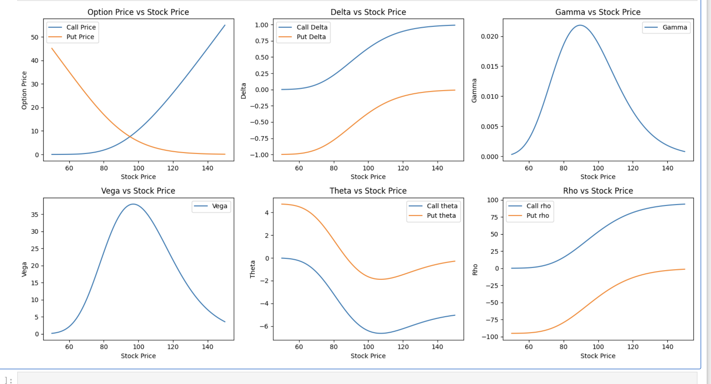
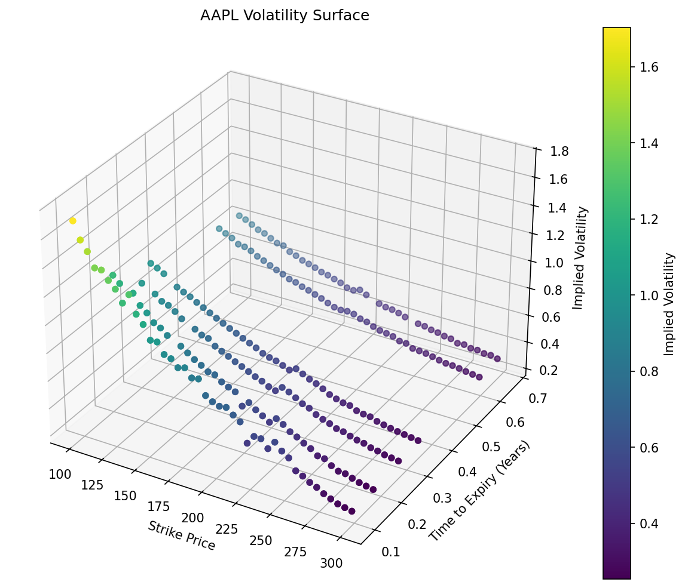
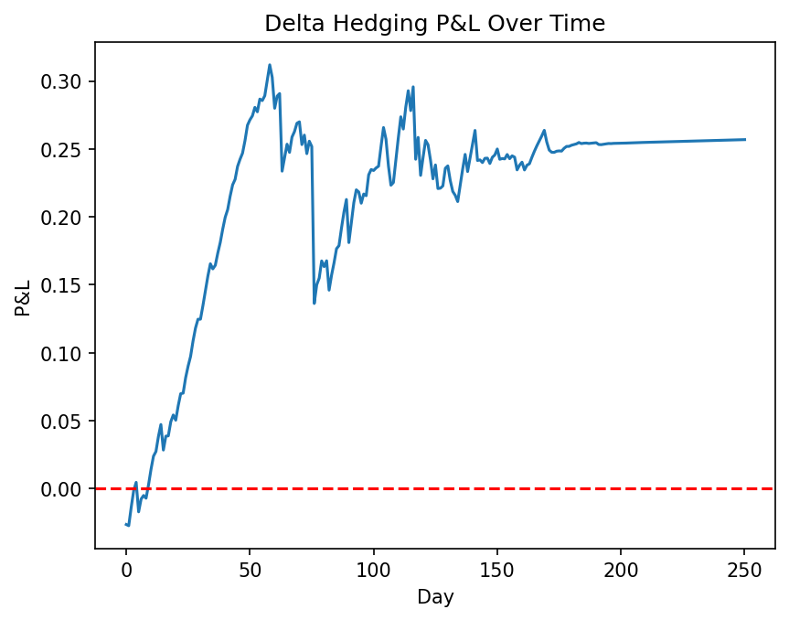

# Options Pricing Engine

Built from scratch in Python — no libraries for the math, just numpy and scipy for basic operations. This project covers the full pipeline from pricing to hedging to live trading.

## What it does
- Prices European call and put options using Black-Scholes
- Computes all 5 Greeks and visualises how they behave across stock prices
- Prices options via Monte Carlo simulation and compares to analytical Black-Scholes
- Solves for implied volatility from real market prices using Newton-Raphson
- Builds a real volatility surface from live AAPL options data
- Simulates a market maker delta hedging a position over 1 year
- Runs a live vol breakout trading strategy on Alpaca paper trading

## Formulas
- Black-Scholes call: S × N(d1) - K × e^(-rT) × N(d2)
- Black-Scholes put: K × e^(-rT) × N(-d2) - S × N(-d1)
- d1 = (ln(S/K) + (r + σ²/2) × T) / (σ × √T)
- d2 = d1 - σ × √T

## Sanity Check
With S=100, K=100, T=1, r=0.05, σ=0.2:
- Call: 10.45 | Put: 5.57
- Delta: 0.637 | Gamma: 0.0188 | Vega: 37.52 | Theta: -6.41 | Rho: 53.23

## Greeks Dashboard
- Delta follows an S-curve — near 0 deep OTM, 0.5 ATM, 1 deep ITM
- Gamma and Vega both peak at ATM where uncertainty is highest
- Theta is most negative at ATM where time value is greatest
- Rho keeps increasing with stock price — unlike others it doesn't peak at ATM

## Monte Carlo Pricing
- Simulates 10,000 stock price paths using Geometric Brownian Motion
- Calculates call/put payoffs across all paths and averages them
- Discounts average payoff to present value using e^(-rT)
- With 100,000 simulations converges to ~10.47 vs Black-Scholes exact answer of 10.45 — Law of Large Numbers in action

## Implied Volatility Solver
- Takes a market option price as input and solves backwards for volatility
- Uses Newton-Raphson with Vega as the derivative — converges in 5-10 iterations
- Example: market price of 10.45 → implied vol of 0.1999 ≈ 0.2

## Volatility Surface
- Pulled live AAPL options data across 6 expiry dates and strikes from $100-$300
- Used our own implied vol solver on each option to build a 3D surface
- Clearly shows volatility skew (higher implied vol for lower strikes) and term structure (shorter dated options have higher implied vol)
- Consistent with theory from Hull Options, Futures and Other Derivatives chapter 19

## Delta Hedging Simulation
- Simulated a market maker selling a call option and rebalancing delta hedge daily for 1 year
- Rebalanced stock position every day to match new delta as stock price moved
- P&L stays close to zero throughout — hedge is working
- Residual noise is Gamma P&L from discrete daily rebalancing rather than continuous hedging

## Vol Breakout Strategy
- Calculates AAPL implied volatility daily using our own implied vol solver on real options data
- Compares to 20-day historical volatility calculated from log returns
- Buys when IV > 1.5 × HV (vol breakout) and sells when IV normalises below HV
- Executes trades automatically via Alpaca paper trading API
- Currently running on $100,000 paper trading account

## Tech Stack
- Python
- NumPy, SciPy, Matplotlib
- pandas (data manipulation)
- yfinance (real options market data)
- mpl_toolkits (3D plotting)
- alpaca-trade-api (paper trading execution)